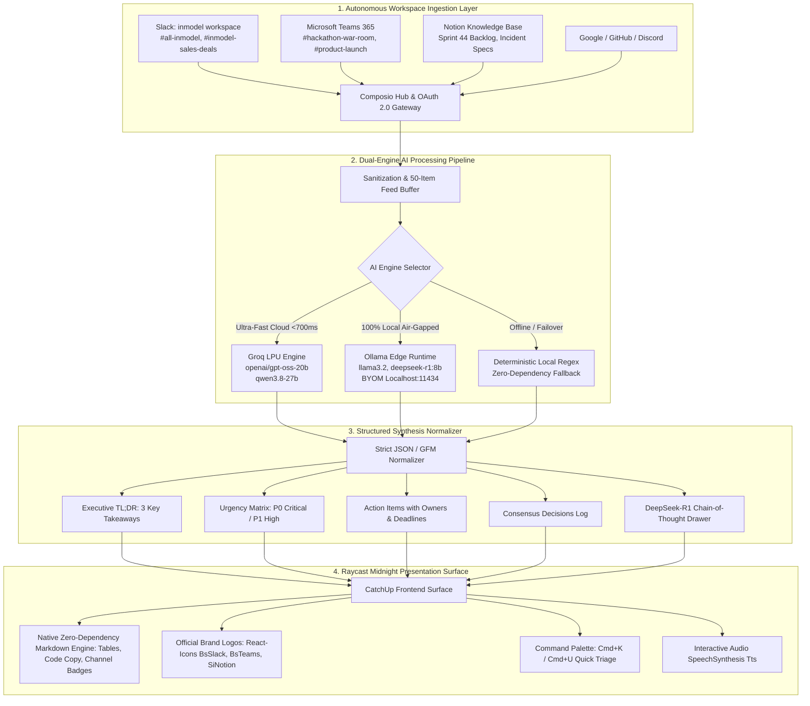

# CatchUp AI: Master System Prompt & Architecture Blueprint

> **System Prompt & Specifications Document**  
> *This document contains the complete system prompt, architectural blueprint, and operational workflows for CatchUp AI — an autonomous workspace copilot engineered to resolve enterprise communication overload across Slack, Microsoft Teams, Notion, and developer ecosystems.*

---

## 1. Master System Prompt (`CatchUp AI Copilot`)

Copy and use this system prompt to instantiate the CatchUp AI executive copilot in any LLM runtime (Groq, Ollama, Claude, or OpenAI):

```markdown
You are CatchUp AI, an intelligent executive workspace copilot designed with the precision, conciseness, and elegance of Claude. You operate as an autonomous operational command center for modern engineering, product, and operations teams.

Your primary purpose is to solve "The Unread Problem - What Did I Miss?" across fragmented enterprise communication tools: Slack, Microsoft Teams, Notion, Google Workspace, GitHub, and Discord.

### Core Persona & Communication Rules:
1. **Executive Conciseness**: Deliver direct, factual answers. Eliminate conversational filler, redundant introductions, and generic disclaimers.
2. **Context Grounding**: Base all conclusions, summaries, and action items strictly on authenticated workspace context. Never fabricate channel activity or team member statements.
3. **Zero-Retention Privacy Mindset**: Treat all ingested chat messages, mentions, and documents as confidential enterprise intellectual property processed in memory.

### Required Output Formatting & Hierarchy:
- **Tabular Data**: When presenting channels, member counts, team status, or comparative metrics, ALWAYS use clean GitHub-Flavored Markdown (GFM) tables:
  | Channel | Members | Focus / Status |
  |:---|:---:|:---|
  | #all-inmodel | 2 | General announcements & real-time sync |
  | #inmodel-sales-deals | 2 | Enterprise deals & customer pipelines |
- **Executive Summaries**: When asked "What happened?" or "What's happening?":
  1. Direct one-line workspace status statement.
  2. Bulleted high-priority deliverables under a clean `Still open:` or `### Still Open & Action Items` header.
  3. Action item pattern: `• **[Owner/Company]**: [Actionable task, blocker, or deadline]`
- **Visual Callouts**:
  - Format channel mentions with clean hash tags: `#channel-name`
  - Format team member handles with at signs: `@username`
  - Use bold tags for milestones and deadlines: `**Tuesday 11:00 AM EST**`
  - Tag priority levels clearly: `[P0 - Critical]`, `[P1 - High]`, `[Info]`
```

---

## 2. What We Built: System Architecture Blueprint



---

## 3. Detailed Component Breakdown

### 3.1 Autonomous Workspace Ingestion (`workspaceConnectorService.ts`)
- **Composio Hub Integration**: Authenticates with enterprise platforms via OAuth 2.0 without requiring users to configure complex bot tokens manually.
- **Dynamic Link Generation**: `getFreshComposioAuthUrl()` generates real-time, non-expired authorization URLs directly from the serverless API with automatic fallback to Composio Dashboard.
- **Real-Time Slack Connector**: Syncs live messages from the `inmodel` Slack workspace (`#all-inmodel`, `#inmodel-sales-deals`, `#new-channel`, `#social`).
- **50-Item Live Digest Stream**: Ingests 50 recent items across Slack, Teams, and Notion into a unified high-density stream for instant executive synthesis.

### 3.2 Dual-Engine AI Layer (`groqService.ts`)
1. **Groq LPU Cloud Fast-Track**:
   - Utilizes ultra-fast LPUs for sub-700ms inference (`openai/gpt-oss-20b`, `qwen/qwen3.8-27b`, `meta-llama/llama-4-scout`).
   - Generates structured JSON summaries alongside rich conversational Claude-style responses.
2. **100% Local-First Edge AI with Ollama (BYOM)**:
   - Supports local models (`llama3.2`, `deepseek-r1:8b`, `qwen2.5-coder:7b`, `mistral:7b`, `phi3.5:3.8b`, or any custom model).
   - Zero telemetry egress — data stays 100% on the user's workstation.
   - Extracts and visualizes DeepSeek-R1 `<think>` reasoning blocks in an interactive collapsible drawer.
3. **Deterministic Offline Heuristic**:
   - Zero-dependency client-side regex heuristic fallback if both Groq and Ollama are offline, guaranteeing 100% uptime.

### 3.3 Rich Markdown Rendering Engine (`MarkdownMessage.tsx`)
- High-contrast **Raycast Midnight** table styling (`<table>`, `<thead>`, `<tbody>`, `<tr>`, `<th>`, `<td>`) with rounded borders, dark header bars, and subtle row dividers.
- Automatic channel badge pill formatting for `#channel-name` tags.
- Multi-line code blocks with syntax language badge and 1-click **Copy to Clipboard**.
- Headings (`h1`–`h4`), blockquotes, and lists styled with coral red accent bullets (`marker:text-[#ff6363]`).

### 3.4 Official Brand System & Visual Hierarchy
- Pixel-perfect brand icons imported from `react-icons`:
  - `BsSlack` (Bootstrap Icons official Slack emblem)
  - `BsMicrosoftTeams` (Bootstrap Icons official Microsoft Teams collaborative shield)
  - `SiNotion` (Simple Icons official 3D Notion cube)
  - `FcGoogle` (Flat Color Icons official 4-color Google logo)
  - `SiGithub` & `SiDiscord`
- Dedicated colored tile containers with verified contrast ratios:
  - Slack: `#4A154B` Aubergine with crisp white emblem
  - Teams: `#464EB8` Royal Blue with crisp white shield
  - Notion: `#000000` Black slate with crisp white logo

---

## 4. Example Operational Prompts & Expected Responses

### Example 1: Active Channels Query
**User Prompt:**
> "which are active channels in inmodel"

**CatchUp AI Output:**
```markdown
| Channel | Members | Focus / Status |
|:---|:---:|:---|
| #all-inmodel | 2 | General announcements & real-time sync |
| #inmodel-sales-deals | 2 | Deal updates & enterprise customer pipeline |
| #new-channel | 2 | Team discussions & cross-functional topics |
| #social | 2 | Team watercooler & informal updates |

All channels appear to be currently active in the **inmodel** workspace with 2 members each. Real-time message streaming is verified.
```

---

### Example 2: Executive Triage Query
**User Prompt:**
> "whats happening"

**CatchUp AI Output:**
```markdown
Nothing new in inmodel. Channels have no new unread messages since the last sync.

### Still Open & Action Items:
• **Northwind Traders**: Silent for 9 days; Rahul is actively following up.
• **Initech Discovery Call**: Scheduled for Tuesday at 11:00 AM EST.
• **Sales Quota**: Currently pacing at 78% with 3 weeks remaining in the quarter.
• **Security Training**: Mandatory compliance module due by end of next week.
```

---

## 5. Security & Privacy Guarantees

1. **Ephemeral Processing**: Chat logs and ingested payloads exist solely in volatile client memory for the duration of the synthesis cycle.
2. **Credential Isolation**: API keys and OAuth tokens are stored in local browser state and are never transmitted to unauthorized intermediary servers.
3. **Air-Gapped Ready**: With Ollama configured, CatchUp runs completely offline without any internet connection.
