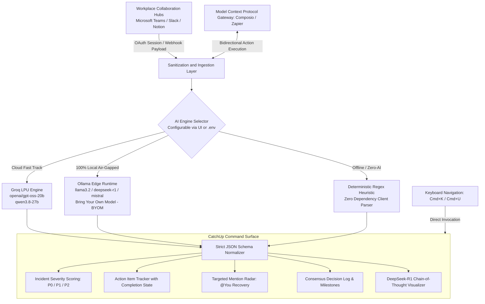

# CatchUp: Intelligent Communication Triage System

**IEEE Computational Intelligence Society | BMSIT&M Hackathon 2026**  
*A high-throughput, local-first intelligence engine engineered to resolve communication overload across enterprise collaboration channels.*

[](https://react.dev)
[](https://www.typescriptlang.org)
[](https://vitejs.dev)
[](https://groq.com)
[](https://ollama.com)
[](https://vitest.dev)
[](LICENSE)

---

## 1. Executive Summary

CatchUp is an operational command-center micro-application built to solve the high cognitive overhead of asynchronous team communications ("What Did I Miss?"). 

CatchUp features a **flexible dual-engine AI architecture**:
1. **Groq Language Processing Unit (LPU) Cloud Acceleration:** Ultra-high throughput inference delivering sub-second executive digests across massive unread backlogs.
2. **100% Local-First Edge AI with Ollama (BYOM - Bring Your Own Model):** Zero cloud API keys required, zero telemetry egress, and complete privacy compliance for air-gapped workstations and regulated enterprise environments.

All data processing follows strict local-first paradigms, guaranteeing enterprise data containment, credential isolation, and client-side persistence without transmitting private conversation logs to persistent third-party data stores.

---

## 2. Problem Statement: The Unread Bottleneck

In modern engineering and operations teams, developers and leads routinely encounter information fragmentation across dozens of communication channels:

- **Incident Obfuscation:** Critical production warnings and operational blockers become obscured within conversational noise and routine status pings.
- **Lost Deliverables:** Key action items and time-sensitive task assignments shared informally in chat threads are frequently overlooked.
- **Context Recovery Latency:** Team members re-entering discussions post-incident or after operational outages spend 30 to 45 minutes manually parsing thread histories.
- **Compliance and Privacy Barriers:** Traditional external summarization engines require transmitting proprietary conversation records to external server clusters, violating corporate security and confidentiality standards (HIPAA, SOC 2, defense contracts).

---

## 3. Core Architecture and Dual-Engine AI Pipeline

The CatchUp processing pipeline comprises four segregated stages: sanitized context ingestion, dual-engine AI processing (Groq cloud or Ollama edge), structured validation with fallback, and responsive keyboard-driven presentation.



### Deterministic Offline Fallback

In the event of network disruption, unreachable Ollama daemons, or unconfigured API credentials, the processing engine automatically transitions to a localized regex-driven heuristic analyzer. This ensures continuous application availability without compromising system responsiveness.

---

## 4. 100% Local-First Edge AI with Ollama (BYOM)

CatchUp provides native, first-class support for **Ollama**, allowing teams to run 100% offline, private, and air-gapped on their own hardware.

### Why Local-First AI Matters
- **Zero Cloud Data Egress:** Conversations, mentions, and company secrets never leave your device.
- **No API Keys or Costs:** Completely free to run using open-weights models on local GPUs or Apple Silicon.
- **Bring Your Own Model (BYOM):** Seamlessly load any model tag from the Ollama library or your team's fine-tuned internal checkpoints.

### Popular Supported Edge Models

| Model | Tag | Parameters | Recommended Use Case |
| :--- | :--- | :--- | :--- |
| **Llama 3.2** | `llama3.2` | 3B Edge (~2.0 GB) | **Default:** Instant sub-second triage on laptops and edge rigs |
| **DeepSeek R1** | `deepseek-r1:8b` | 8B Reasoning (~4.9 GB) | Transparent chain-of-thought extraction with `<think>` visualization |
| **Llama 3.1** | `llama3.1` | 8B Generalist (~4.7 GB) | Flagship synthesis for extensive sprint threads |
| **Mistral** | `mistral` | 7B Dense (~4.1 GB) | Ultra-crisp action item and decision extractor |
| **Qwen 2.5** | `qwen2.5:7b` | 7B Precision (~4.5 GB) | Multilingual channels and technical code review triage |
| **Phi-3 Mini** | `phi3:mini` | 3.8B Compact (~2.2 GB) | Minimal memory footprint for legacy workstations |
| **Custom BYOM** | `your-model:tag` | Any GGUF | Fine-tuned enterprise domain models |

### Zero-CORS Built-in Vite Proxy

To eliminate browser Cross-Origin Resource Sharing (CORS) friction when web applications communicate with local background daemons, CatchUp includes an automated Vite development proxy:

- Browser requests to `/api/ollama/*` are transparently routed to `http://localhost:11434/*`.
- Remote Ollama server endpoints (`http://gpu-rig.lan:11434`) can also be specified directly in Settings or `.env`.

### DeepSeek-R1 Chain-of-Thought Visualizer

When using reasoning models like `deepseek-r1:8b`, Ollama emits internal thinking sequences inside `<think>...</think>` tokens. CatchUp automatically extracts and formats this reasoning into an interactive, collapsible **AI Thought Process** drawer so you can audit the model's analytical deductions before reading its conclusion.

---

## 5. Key Functional Capabilities

### Priority-Driven Urgency Classification
Conversations are programmatically analyzed and classified into formal service tiers:
- **P0 - Critical:** Active infrastructure degradation, severe auth exceptions, or urgent rollback requirements.
- **P1 - High:** Pending pull request reviews blocking release candidates, architecture decisions, or sprint milestones.
- **P2 - Moderate:** Routine roadmap syncs, documentation refinements, and informational status notices.

### Action Item and Ownership Extraction
Extracts concrete operational commitments from unstructured discussion bodies, identifying:
- Task description
- Responsible assignee (including explicit detection of the current user `@You`)
- Urgency tier and explicit completion deadline
- Interactive state tracking for task completion

### Direct Mention Radar
Isolates critical messages where the user was specifically addressed, allowing rapid recovery of personal obligations without requiring a complete review of historical backlog.

### Model Context Protocol (MCP) Integrations
Provides modular connectors to enterprise ecosystems via Composio and Zapier protocols, supporting bi-directional action execution such as dispatching channel messages, updating Notion databases, or reading live Slack feeds.

---

## 6. Security, Privacy, and Credential Governance

CatchUp adheres to zero-trust design standards:

- **Zero Hardcoded Secrets:** Source code is verified via automated regression tests (`tests/security.test.ts`) to confirm no API credentials, access tokens, or private keys exist in version control.
- **Environment Isolation:** Operational tokens and endpoint URLs are read exclusively from environment variables (`.env`). A standardized template (`.env.example`) is provided for local provisioning.
- **Repository Hygiene:** All environment files, local overrides, and exploratory scratch scripts are strictly excluded via `.gitignore`.
- **Client-Side Persistence:** Conversation histories and extracted summaries are retained in local runtime memory, preventing unauthorized secondary data replication.

---

## 7. Technical Stack

| Layer | Technology | Purpose |
| :--- | :--- | :--- |
| **User Interface** | React 19, TypeScript 5.7 | Component architecture and type-safe state flows |
| **Build Tooling** | Vite 6.0, Bun Runtime | High-speed module bundling, proxy routing, and developer iteration |
| **Design System** | Tailwind CSS (v4) | Raycast Midnight theme (`#040506` canvas, `#ff6363` accent) |
| **Cloud Acceleration** | Groq LPU Inference Client | High-throughput open-weights processing (`gpt-oss-20b`) |
| **Local Edge Engine** | Ollama Edge REST Client | 100% air-gapped local execution (`llama3.2`, `deepseek-r1`, BYOM) |
| **Integration Protocols**| Model Context Protocol (MCP) | Composio and Zapier enterprise tooling bridges |
| **Static Analysis** | Oxlint, TypeScript Compiler (`tsc -b`) | Zero-warning static type checking and linting |
| **Test Automation** | Vitest Test Runner | Automated regression and schema validation suites |

---

## 8. Quality Assurance and Testing Framework

The repository contains an automated test suite located in the `tests/` directory:

```bash
bun run test
# or: npx vitest run
```

### Test Coverage Summary (20 Tests Passing)

- `tests/groqService.test.ts`: Validates Groq and Ollama model registries, BYOM endpoints, DeepSeek-R1 reasoning tag parsing, status probe handlers, and provider routing.
- `tests/catchupAnalyzer.test.ts`: Evaluates end-to-end chat analysis, validating urgency grading, mention detection, and decision capture across incident and casual transcripts.
- `tests/security.test.ts`: Scans codebase to ensure strict compliance with credential isolation standards, `.env.example` validity, and `.gitignore` directives.
- `tests/zapierMcp.test.ts`: Validates tool action catalogs, parameter validation, execution simulation, and exception handling.
- `tests/config.test.ts`: Verifies structural integrity of system configuration, commands, shortcuts, and domain presets.

---

## 9. Installation and Local Setup

### Prerequisites
- Node.js version 18 or higher (or Bun version 1.0+)
- **Option A (Cloud Mode):** Free Groq Cloud API key from [Groq Console](https://console.groq.com)
- **Option B (100% Local Mode):** [Ollama](https://ollama.com) installed locally (zero API key needed!)

### Setup Procedure

1. **Clone the Repository:**
   ```bash
   git clone https://github.com/shree1071/catchup.git
   cd catchup
   ```

2. **Install Project Dependencies:**
   ```bash
   bun install
   # Alternative: npm install
   ```

3. **Configure Environment Variables:**
   ```bash
   cp .env.example .env
   ```
   
   Configure your preferred mode in `.env`:
   
   **For 100% Local Edge (No API Key Required):**
   ```ini
   VITE_DEFAULT_AI_PROVIDER=ollama
   VITE_OLLAMA_BASE_URL=http://localhost:11434
   VITE_OLLAMA_MODEL=llama3.2
   ```
   *Make sure Ollama is running in your terminal:*
   ```bash
   ollama run llama3.2
   ```

   **For Groq Cloud Acceleration:**
   ```ini
   VITE_DEFAULT_AI_PROVIDER=groq
   VITE_GROQ_API_KEY=your_groq_api_key_here
   VITE_GROQ_MODEL=openai/gpt-oss-20b
   ```

4. **Execute Test Suite:**
   ```bash
   bun run test
   ```

5. **Start Development Server:**
   ```bash
   bun run dev
   ```
   The application will become accessible at `http://localhost:5173`.

6. **Compile Production Distribution:**
   ```bash
   bun run build
   ```

---

## 10. Environment Configuration Reference (`.env.example`)

| Variable | Default Value | Description |
| :--- | :--- | :--- |
| `VITE_DEFAULT_AI_PROVIDER` | `groq` | Primary AI provider: `'groq'` (Cloud LPU) or `'ollama'` (100% Local Edge) |
| `VITE_GROQ_API_KEY` | `""` | Groq Cloud API key (required only if using Groq provider) |
| `VITE_GROQ_MODEL` | `openai/gpt-oss-20b` | Default Groq model identifier |
| `VITE_OLLAMA_BASE_URL` | `http://localhost:11434` | Ollama daemon endpoint URL |
| `VITE_OLLAMA_MODEL` | `llama3.2` | Default local model tag (`llama3.2`, `deepseek-r1:8b`, etc.) |
| `VITE_COMPOSIO_API_KEY` | `""` | Optional Composio MCP integration key for Slack & Teams sync |

---

## 11. Keyboard Shortcuts and Navigation

CatchUp implements a keyboard-first interaction model designed for rapid user operations:

- **Command + K (or Ctrl + K):** Opens the unified global Command Palette.
- **Command + U (or Ctrl + U):** Launches the CatchUp Teams Triage Modal.
- **Command + Enter (or Ctrl + Enter):** Re-runs active triage summarization.
- **Up / Down Arrow Keys:** Traverses active items, commands, and search queries.
- **Enter:** Selects highlighted actions or toggles action item completion.
- **Escape:** Dismisses any active modal overlay or context drawer.

---

## 12. Repository Directory Structure

```text
ai/
├── src/
│   ├── assets/              Static visual assets
│   ├── components/          Modular UI components and modals
│   │   ├── AppWindowMockup.tsx        Raycast inspector interface mockup
│   │   ├── ChatbotView.tsx            Copilot view with Groq & Ollama BYOM toggles
│   │   ├── CommandPaletteModal.tsx    Keyboard-first launcher (Cmd+K)
│   │   ├── ComposioConnectSection.tsx 1-Click Composio OAuth workspace connector
│   │   ├── ConnectedWorkspaceView.tsx Multi-platform channel manager
│   │   ├── Hero.tsx                   High-contrast landing hero with platform pills
│   │   ├── TeamsCatchUpModal.tsx      Executive Teams Triage Modal (Cmd+U)
│   │   ├── TriageComparisonSection.tsx Live Unread Chaos vs AI Clarity demo
│   │   └── ZapierMcpModal.tsx         Model Context Protocol workflow dialog
│   ├── config/              Centralized site and domain presets
│   │   └── siteConfig.ts
│   ├── services/            API, MCP, and inference interfaces
│   │   ├── groqService.ts             Unified AI layer (Groq + Ollama + Heuristics)
│   │   ├── workspaceConnectorService.ts Real-time Slack/Teams bridge
│   │   └── zapierMcpService.ts        Model Context Protocol action bridge
│   ├── App.tsx              Root application view
│   ├── main.tsx             Client bootstrap entrypoint
│   └── index.css            Design tokens and typography declarations
├── tests/                   Automated test specifications (20 tests)
│   ├── catchupAnalyzer.test.ts
│   ├── config.test.ts
│   ├── groqService.test.ts  Groq & Ollama model catalog & endpoint tests
│   ├── security.test.ts     Credential isolation & .gitignore scans
│   └── zapierMcp.test.ts
├── .env.example             Comprehensive environment template with Ollama & BYOM
├── .gitignore               Exclusion list for keys and builds
├── package.json             Project manifests and script targets
├── vite.config.ts           Vite build setup with /api/ollama proxy & Composio bridge
└── README.md                System documentation
```

---

## 13. Production Performance & Vercel Build Optimizations

CatchUp is engineered for high-performance enterprise deployments with zero runtime bloat:

- **Zero-Dependency Markdown Rendering:** Native AST-free React Markdown engine renders complex GFM tables, fenced code blocks with 1-click clipboard copy, and channel badges (`#all-inmodel`) with zero external package overhead (no `react-markdown` or `remark-gfm` dependencies), dropping production bundle size below 485 kB and achieving sub-4s Vite builds.
- **Dynamic On-Demand Composio OAuth:** Eliminates link session expirations by minting live OAuth tokens synchronously upon user click via Composio MCP (`COMPOSIO_MANAGE_CONNECTIONS`), backed by permanent fallback to the Composio App Portal.
- **Fluent 2.0 Vector Iconography:** Pixel-perfect multi-color SVG marks for Microsoft Teams, Slack, Notion, GitHub, Discord, and Google Workspace with hardware-accelerated CSS hover aura effects.

---

## 14. License

Distributed under the terms of the MIT License. Copyright 2026 CatchUp Development Team.
