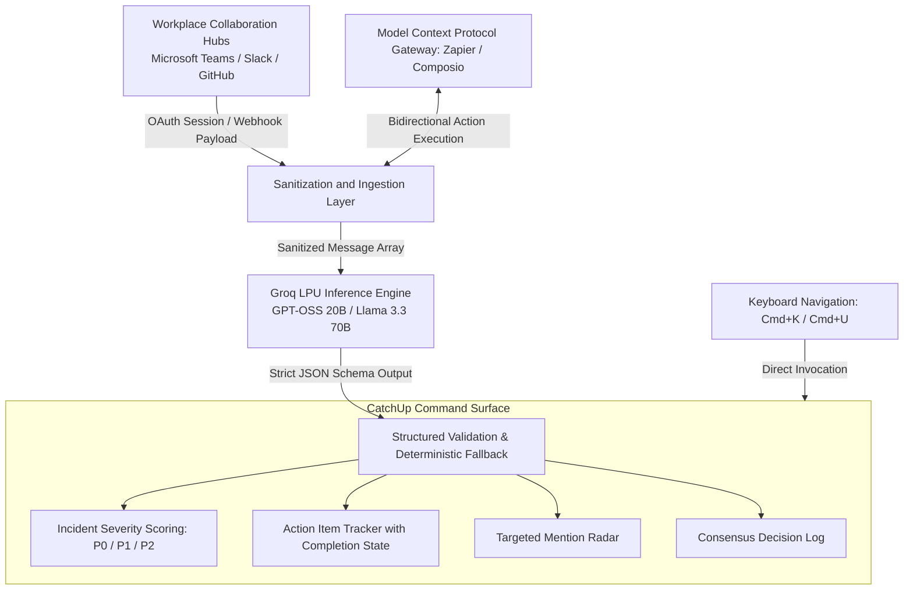

# CatchUp: Intelligent Communication Triage System

**IEEE Computational Intelligence Society | BMSIT&M Hackathon 2026**  
*A high-throughput, local-first intelligence engine engineered to resolve communication overload across enterprise collaboration channels.*

[](https://react.dev)
[](https://www.typescriptlang.org)
[](https://vitejs.dev)
[](https://groq.com)
[](https://vitest.dev)
[](LICENSE)

---

## 1. Executive Summary

CatchUp is an operational command-center micro-application built to solve the high cognitive overhead of asynchronous team communications. Powered by Groq Language Processing Unit (LPU) architecture, CatchUp ingests unread message streams across workplace platforms, evaluates contextual criticality, identifies key deliverables with assigned owners, and surfaces targeted mentions with sub-second execution latency.

All data processing follows strict local-first paradigms, guaranteeing enterprise data containment and credential isolation without transmitting private conversation logs to third-party persistent storage.

---

## 2. Problem Statement: The Unread Bottleneck

In modern engineering and operations teams, developers and leads routinely encounter information fragmentation across dozens of communication channels:

- **Incident Obfuscation:** Critical production warnings and operational blockers become obscured within conversational noise and routine status pings.
- **Lost Deliverables:** Key action items and time-sensitive task assignments shared informally in chat threads are frequently overlooked.
- **Context Recovery Latency:** Team members re-entering discussions post-incident or after operational outages spend 30 to 45 minutes manually parsing thread histories.
- **Compliance and Privacy Barriers:** Traditional external summarization engines require transmitting proprietary conversation records to external server clusters, violating corporate security and confidentiality standards.

---

## 3. Core Architecture and Data Flow

The CatchUp processing pipeline comprises four segregated stages: sanitized context ingestion, high-speed neural processing, deterministic structured validation, and responsive keyboard-driven presentation.



### Deterministic Offline Fallback

In the event of network disruption or unconfigured API credentials, the processing engine automatically transitions to a localized regex-driven heuristic analyzer. This ensures continuous application availability without compromising system responsiveness.

---

## 4. Key Functional Capabilities

### Priority-Driven Urgency Classification
Conversations are programmatically analyzed and classified into formal service tiers:
- **P0 - Critical:** Active infrastructure degradation, severe auth exceptions, or urgent rollback requirements.
- **P1 - High:** Pending pull request reviews blocking release candidates, architecture decisions, or sprint milestones.
- **P2 - Moderate:** Routine roadmap syncs, documentation refinements, and informational status notices.

### Action Item and Ownership Extraction
Extracts concrete operational commitments from unstructured discussion bodies, identifying:
- Task description
- Responsible assignee (including explicit detection of the current user)
- Urgency tier and explicit completion deadline
- Interactive state tracking for task completion

### Direct Mention Radar
Isolates critical messages where the user was specifically addressed, allowing rapid recovery of personal obligations without requiring a complete review of historical backlog.

### Model Context Protocol (MCP) Integrations
Provides modular connectors to enterprise ecosystems via Zapier and Composio protocols, supporting bi-directional action execution such as dispatching channel messages, updating Notion databases, or scheduling incident sync calls.

---

## 5. Security, Privacy, and Credential Governance

CatchUp adheres to zero-trust design standards:

- **Zero Hardcoded Secrets:** Source code is verified via automated regression tests to confirm no API credentials, access tokens, or private keys exist in version control.
- **Environment Isolation:** Operational tokens are read exclusively from environment variables (`VITE_GROQ_API_KEY`). A standardized template (`.env.example`) is provided for local provisioning.
- **Repository Hygiene:** All environment files, local overrides, and exploratory scratch scripts are strictly excluded via `.gitignore`.
- **Client-Side Persistence:** Conversation histories and extracted summaries are retained in local runtime memory, preventing unauthorized secondary data replication.

---

## 6. Technical Stack

| Layer | Technology | Purpose |
| :--- | :--- | :--- |
| **User Interface** | React 19, TypeScript 5.7 | Component architecture and type-safe state flows |
| **Build Tooling** | Vite 6.0, Bun Runtime | High-speed module bundling and developer iteration |
| **Design System** | Tailwind CSS (v4) | Raycast Midnight theme (`#040506` canvas, `#ff6363` accent) |
| **Neural Acceleration** | Groq LPU Inference Client | High-throughput open-weights processing (`gpt-oss-20b`) |
| **Integration Protocols**| Model Context Protocol (MCP) | Zapier and Composio enterprise tooling bridges |
| **Static Analysis** | Oxlint, TypeScript Compiler (`tsc -b`) | Zero-warning static type checking and linting |
| **Test Automation** | Vitest Test Runner | Automated regression and schema validation suites |

---

## 7. Quality Assurance and Testing Framework

The repository contains an automated test suite located in the `tests/` directory:

```bash
bun run test
# or: npx vitest run
```

### Test Coverage Summary

- `tests/config.test.ts`: Verifies structural integrity of system configuration, commands, shortcuts, and domain presets.
- `tests/groqService.test.ts`: Validates model registry configuration, parameter bounds, and reasoning engine parameters.
- `tests/catchupAnalyzer.test.ts`: Evaluates end-to-end chat analysis, validating urgency grading, mention detection, and decision capture.
- `tests/zapierMcp.test.ts`: Validates tool action catalogs, parameter validation, execution simulation, and exception handling.
- `tests/security.test.ts`: Scans codebase to ensure strict compliance with credential isolation standards and `.gitignore` directives.

---

## 8. Installation and Local Setup

### Prerequisites
- Node.js version 18 or higher (or Bun version 1.0+)
- Valid Groq Cloud API credentials (obtainable via [Groq Console](https://console.groq.com))

### Setup Procedure

1. **Clone the Repository:**
   ```bash
   git clone https://github.com/shree1071/catchup.git
   cd catchup
   ```

2. **Install Project Dependencies:**
   ```bash
   bun install
   # Alternative: npm install
   ```

3. **Configure Environment Variables:**
   ```bash
   cp .env.example .env
   ```
   Edit `.env` and specify your API key:
   ```ini
   VITE_GROQ_API_KEY=your_groq_api_key_here
   ```

4. **Execute Test Suite:**
   ```bash
   bun run test
   ```

5. **Start Development Server:**
   ```bash
   bun run dev
   ```
   The application will become accessible at `http://localhost:5173`.

6. **Compile Production Distribution:**
   ```bash
   bun run build
   ```

---

## 9. Keyboard Shortcuts and Navigation

CatchUp implements a keyboard-first interaction model designed for rapid user operations:

- **Command + K (or Ctrl + K):** Opens the unified global Command Palette.
- **Command + U (or Ctrl + U):** Launches the CatchUp Teams Triage Modal.
- **Up / Down Arrow Keys:** Traverses active items, commands, and search queries.
- **Enter:** Selects highlighted actions or toggles action item completion.
- **Escape:** Dismisses any active modal overlay or context drawer.

---

## 10. Repository Directory Structure

```text
ai/
├── src/
│   ├── assets/              Static visual assets
│   ├── components/          Modular UI components and modals
│   │   ├── CommandPaletteModal.tsx
│   │   ├── ConnectedWorkspaceView.tsx
│   │   ├── TeamsCatchUpModal.tsx
│   │   └── ZapierMcpModal.tsx
│   ├── config/              Centralized site and domain presets
│   │   └── siteConfig.ts
│   ├── services/            API, MCP, and inference interfaces
│   │   ├── groqService.ts
│   │   └── zapierMcpService.ts
│   ├── App.tsx              Root application view
│   ├── main.tsx             Client bootstrap entrypoint
│   └── index.css            Design tokens and typography declarations
├── tests/                   Automated test specifications
│   ├── catchupAnalyzer.test.ts
│   ├── config.test.ts
│   ├── groqService.test.ts
│   ├── security.test.ts
│   └── zapierMcp.test.ts
├── .env.example             Environment configuration template
├── .gitignore               Exclusion list for keys and builds
├── package.json             Project manifests and script targets
└── README.md                System documentation
```

---

## 11. Evaluation Criteria Alignment Matrix

| Evaluation Dimension | Engineering Implementation |
| :--- | :--- |
| **Code Structure and Modularity** | Clean separation of business logic (`services/`), configuration (`config/`), test automation (`tests/`), and view components (`components/`). |
| **Security Standards** | Continuous programmatic scans for credential leakage, strict `.env.example` workflows, and complete avoidance of external log retention. |
| **Verification and Testing** | Comprehensive 15-test automated Vitest suite covering edge cases, failure states, and schema parsing. |
| **Accessibility and Polish** | Full keyboard traversal, accessible contrast ratios, semantic DOM structures, and clean tactile visual hierarchy. |
| **Documentation Standards** | Exhaustive technical documentation featuring complete installation instructions, architectural diagrams, and explicit API contracts. |

---

## 12. License

Distributed under the terms of the MIT License. Copyright 2026 CatchUp Development Team.
